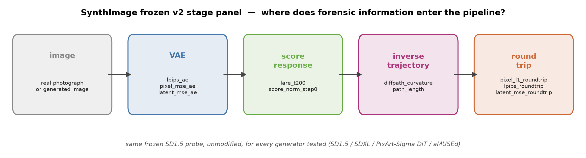
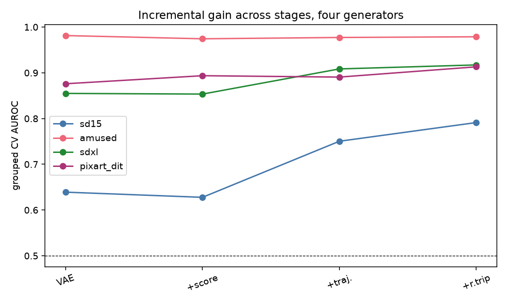
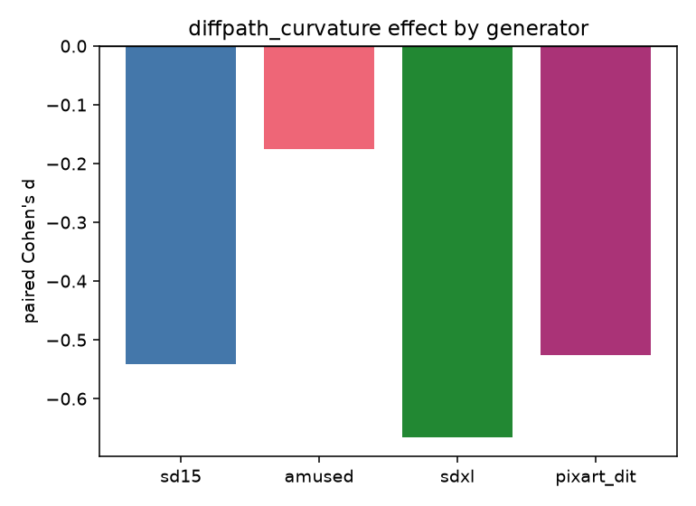
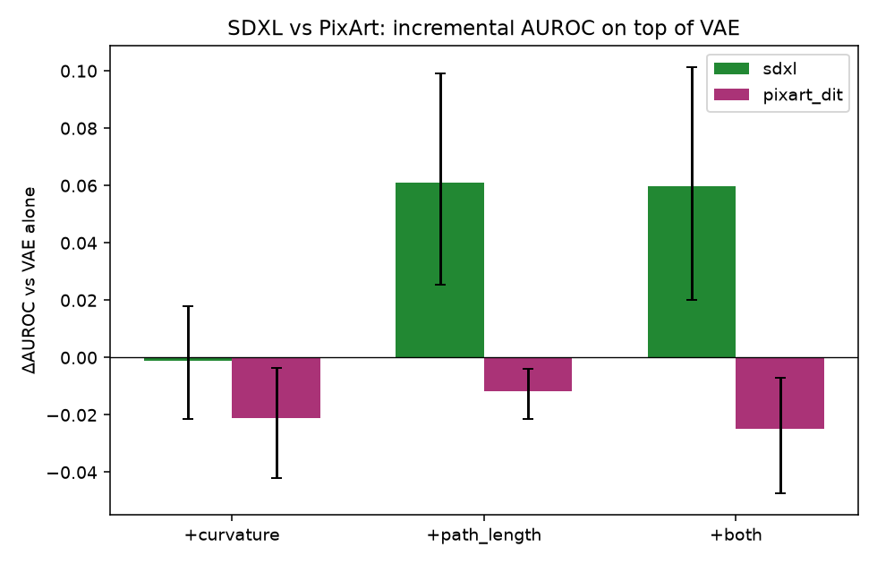
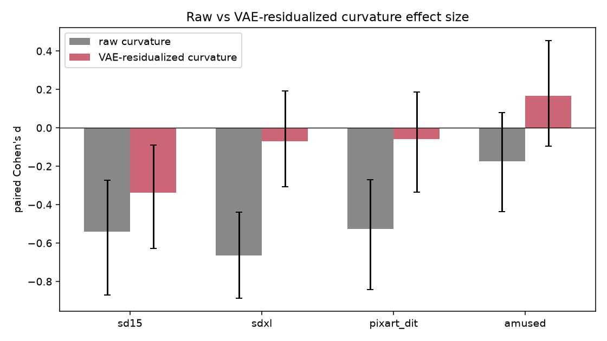

# SynthImage

**Where does AI-image forensic information live inside a pretrained diffusion pipeline — and does it survive
changes in generator architecture, realistic image transformations, and partial AI editing?**



SynthImage uses one frozen, pretrained Stable Diffusion 1.5 model purely as a **measurement instrument**: every
image (real or AI-generated, from any generator) is pushed through the same VAE encode/decode, a short
inversion trajectory, and a round-trip reconstruction, and ten literature-grounded scalar features are read off
at each stage. The question throughout is not "how good is the best detector we can build" but **"which stage
adds genuinely new information beyond the earlier ones, and for which generator architectures does that hold?"**

## Headline findings

1. **Naive AI-image benchmarks are badly confounded.** On this project's own first large-scale benchmark, four
   simple file-geometry numbers beat a 652-feature learned representation, and caption text alone reached
   AUROC 0.79 with zero image information. Every result below uses a content-matched design specifically built
   to remove this class of shortcut.
2. **VAE reconstruction error alone is a strong, generator-dependent forensic signal** — from AUROC 0.64 (SD1.5)
   to 0.98 (aMUSEd) depending entirely on how good that generator's own decoder is.
3. **The diffusion trajectory adds real information beyond VAE reconstruction for UNet-based diffusion models
   (SD1.5, SDXL) but not for a genuine Diffusion Transformer (PixArt-Sigma)** — ruling out the simplest
   "diffusion models generically show this" hypothesis.
4. **That architecture split is explained by one specific feature: `path_length`.** Cross-fitted residualization
   shows `path_length` carries information independent of VAE-level features for SD1.5/SDXL but not PixArt-Sigma,
   and decomposing SDXL's trajectory-stage gain shows `path_length` alone reproduces essentially all of it —
   `diffpath_curvature`'s own marginal contribution is not distinguishable from zero anywhere in that
   decomposition.
5. **Realistic-transformation robustness and AI-edit-strength response** (JPEG/blur/resize/noise/crop/color
   jitter; a 60-content img2img edit-strength continuum) — see `docs/FINAL_RESULTS.md` §8–9 for current status.

Full narrative, all numbers, and honest limitations: **[`docs/FINAL_RESULTS.md`](docs/FINAL_RESULTS.md)**.

## Method overview

```
image → SD1.5 VAE → score response → inverse trajectory → round-trip reconstruction
         (static)      (score mag.)    (curvature, path)      (DIRE-style)
```

Ten features, each a direct reproduction of a published forensic method (AEROBLADE, LaRE², DiffPath, DIRE) or a
small, explicitly disclosed adaptation — never invented because a tensor happened to be available. Every
statistical test groups by content id (a real image and its generated counterpart never split across a
train/test fold) and uses one fixed, simple classifier
(`StandardScaler` + `LogisticRegression`) throughout. Full methodology: **[`docs/METHODS.md`](docs/METHODS.md)**.

## Generators tested

| generator | architecture | role |
|---|---|---|
| SD1.5 | UNet latent diffusion | the frozen probe itself, and the first generator tested |
| SDXL | UNet latent diffusion (larger, separate VAE) | second diffusion generator — does the SD1.5 result replicate? |
| PixArt-Sigma | Diffusion Transformer (no UNet) | architecture-disambiguation generator — is this a diffusion property or a UNet property? |
| aMUSEd | masked-token model (no diffusion process) | non-diffusion negative control |

## Key figures

| | |
|---|---|
|  Stage-wise incremental AUROC, four generators |  `diffpath_curvature` effect size across architectures |
|  The decisive result: `path_length` explains the SDXL-vs-PixArt split |  Raw vs. VAE-residualized trajectory effect |

## Reproduce the headline result

```bash
uv sync
uv run python scripts/dit_stage_decomposition_analysis.py
uv run python scripts/path_length_mechanism_analysis.py
```

Both read already-extracted, committed feature tables under `results/` — no GPU, no model download. Full
reproduction (including regenerating those feature tables from raw images) is documented in
**[`docs/REPRODUCIBILITY.md`](docs/REPRODUCIBILITY.md)**.

## Repository layout

```
SynthImage/
├── README.md                    you are here
├── docs/
│   ├── FINAL_RESULTS.md          the scientific synthesis — start here for the full story
│   ├── METHODS.md                frozen methodology in detail
│   ├── REPRODUCIBILITY.md        environment setup, data provenance, reproduction commands
│   └── research_history/         full chronological research ledger, preregistrations, superseded phases
├── src/                          probe, feature panel, corruption/transform suite
├── scripts/                      generation, extraction, analysis (scripts/README.md indexes all of them)
├── results/
│   └── summary/                  the figures and diagram used above
├── tests/                        scientific-correctness tests (leakage, frozen definitions, determinism)
├── hpc/                          generic PBS/Apptainer job templates (placeholders, not this project's own cluster)
├── data/README.md                dataset provenance and regeneration instructions (data/ itself is not committed)
├── FINAL_VALIDATION_PLAN.md      the frozen protocol for the final robustness/AI-edit validation phase
├── SYNTHIMAGE_PROJECT_STATE.md   current project status (closed to active experimentation)
└── PUBLIC_RELEASE_CHECKLIST.md   pre-publication audit
```

## Installation

Requires Python 3.12 and [`uv`](https://docs.astral.sh/uv/):

```bash
git clone <this-repository-url>
cd SynthImage
uv sync
uv run pytest   # scientific-correctness test suite
```

## Limitations

This project does not claim a universal AI-image detector, generator-independent deployment performance, that
raw diffusion-path curvature alone proves diffusion provenance, or that any AI-edit-strength response
represents a calibrated "percent AI" score. The `path_length` architecture-dependence result is established for
exactly one Diffusion Transformer (PixArt-Sigma) and two UNet models (SD1.5, SDXL) — a real mechanism-level
finding about these three generators specifically, not yet shown to generalize to Diffusion Transformers in
general. Full discussion: `docs/FINAL_RESULTS.md` §10.

## Status

Active experimentation on this project is closed — see `SYNTHIMAGE_PROJECT_STATE.md`. Possible future
directions are recorded under "Future work" in `docs/FINAL_RESULTS.md`, not as an open invitation to keep
iterating here.

## License

See `PUBLIC_RELEASE_CHECKLIST.md` — a license decision is required before public release and has not been made
by the project owner yet.
