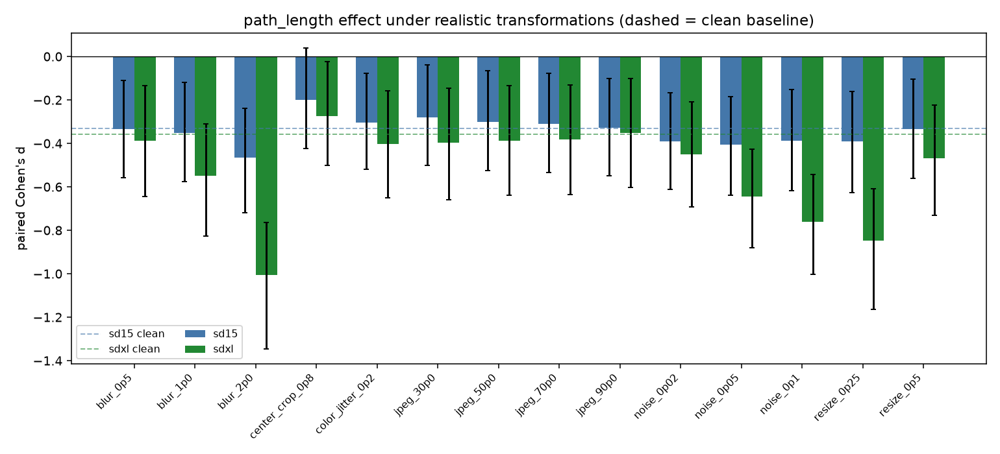
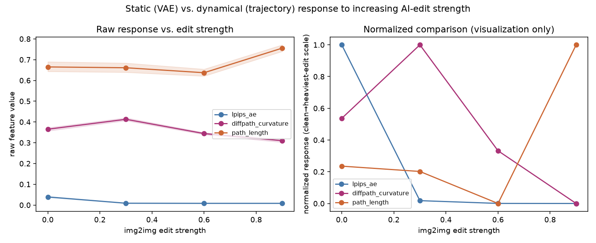

# SynthImage

[](https://github.com/jeillei/SynthImage/actions/workflows/tests.yml)
[](LICENSE)

**Where does AI-image forensic information live inside a pretrained diffusion pipeline — and does it survive
changes in generator architecture, realistic image transformations, and partial AI editing?**


SynthImage uses one frozen, pretrained Stable Diffusion 1.5 model purely as a **measurement instrument**: every
image (real or AI-generated, from any generator) is pushed through the same VAE encode/decode, a short
inversion trajectory, and a round-trip reconstruction, and ten literature-grounded scalar features are read off
at each stage. The question throughout is not "how good is the best detector we can build" but **"which stage
adds genuinely new information beyond the earlier ones, and for which generator architectures does that hold?"**

## Headline findings

1. **Naive AI-image benchmarks are badly confounded.** On this project's own first large-scale benchmark, four
   simple file-geometry numbers beat a 652-feature learned representation, and caption text alone reached
   AUROC 0.79 with zero image information. Every result below uses a content-matched design specifically built
   to remove this class of shortcut.
2. **VAE reconstruction error alone is a strong, generator-dependent forensic signal** — from AUROC 0.64 (SD1.5)
   to 0.98 (aMUSEd), tracking how well each generator's own decoder reconstructs images.
3. **The diffusion trajectory adds real information beyond VAE reconstruction for the two UNet-based diffusion
   generators tested (SD1.5, SDXL) but not for the one Diffusion Transformer tested (PixArt-Sigma)** — ruling out
   the simplest "diffusion models generically show this" hypothesis, though not yet a class-general claim about
   UNets vs. DiTs.
4. **That architecture split is explained by one specific feature: `path_length`.** Cross-fitted residualization
   shows `path_length` carries information independent of VAE-level features for SD1.5/SDXL but not PixArt-Sigma,
   and decomposing SDXL's trajectory-stage gain shows `path_length` alone reproduces essentially all of it —
   `diffpath_curvature`'s own marginal contribution is not distinguishable from zero anywhere in that
   decomposition.
5. **`path_length`'s signal is realistic-transformation-robust.** Across 14 transformation conditions
   (JPEG/blur/resize/noise/color-jitter/crop) × SD1.5/SDXL (28 condition/generator combinations), its
   VAE-independent effect survived in 27/28 and its incremental AUROC contribution survived in all 28 — and a
   classifier trained only on clean images transferred with only modest degradation to every transformed
   condition, no recalibration.
6. **VAE reconstruction tracks increasing AI-edit strength far more monotonically than the trajectory features
   do** (a 60-content img2img-strength continuum) — a genuine, unforced difference between the static and
   dynamic mechanisms, reported as found rather than smoothed into a stronger claim.

Full narrative, all numbers, and honest limitations: **[`docs/FINAL_RESULTS.md`](docs/FINAL_RESULTS.md)**.

## Method overview

```
image → SD1.5 VAE → score response → inverse trajectory → round-trip reconstruction
         (static)      (score mag.)    (curvature, path)      (DIRE-style)
```

Ten features, each a direct reproduction of a published forensic method (AEROBLADE, LaRE², DiffPath, DIRE) or a
small, explicitly disclosed adaptation — never invented because a tensor happened to be available. Every
statistical test groups by content id (a real image and its generated counterpart never split across a
train/test fold) and uses one fixed, simple classifier
(`StandardScaler` + `LogisticRegression`) throughout. Full methodology: **[`docs/METHODS.md`](docs/METHODS.md)**.

## Generators tested

| generator | architecture | role |
|---|---|---|
| SD1.5 | UNet latent diffusion | the frozen probe itself, and the first generator tested |
| SDXL | UNet latent diffusion (larger, separate VAE) | second diffusion generator — does the SD1.5 result replicate? |
| PixArt-Sigma | Diffusion Transformer (no UNet) | architecture-disambiguation generator — is this a diffusion property or a UNet property? |
| aMUSEd | masked-token model (no diffusion process) | non-diffusion negative control |

## Key figures

| | |
|---|---|
|  Stage-wise incremental AUROC, four generators |  `diffpath_curvature` effect size across architectures |
|  The decisive result: `path_length` explains the SDXL-vs-PixArt split |  Raw vs. VAE-residualized trajectory effect |
|  `path_length` under 14 realistic transformations |  Static (VAE) vs. dynamic (trajectory) response to AI-edit strength |

## Quick reproduction

```bash
uv sync
uv run python scripts/reproduce/final_analysis.py
```

Reproduces every headline table and figure above from already-extracted, committed feature tables under
`results/` — ordinary CPU, no GPU, no model download, a few minutes. Full reproduction (regenerating those
feature tables from raw images) is documented in **[`docs/REPRODUCIBILITY.md`](docs/REPRODUCIBILITY.md)**.

## Analyze your own image

```bash
uv run python scripts/reproduce/analyze_image.py your_photo.jpg --caption "a plausible description"
```

Extracts the same ten frozen measurements from any image of your own. **This is a research measurement command,
not a detector** — it prints the raw feature values (VAE reconstruction, score response, `diffpath_curvature`,
`path_length`, round-trip quantities), not a REAL/AI verdict; a single number in isolation isn't meaningful
without a reference cohort like the ones already committed under `results/`. Requires the SD1.5 weights
(~5GB, fetched automatically on first use). Run with `--help` for all options, including `--device` and
`--skip-lpips`.

## Repository layout

```
SynthImage/
├── README.md                    you are here
├── docs/
│   ├── FINAL_RESULTS.md          the scientific synthesis — start here for the full story
│   ├── METHODS.md                frozen methodology in detail
│   ├── REPRODUCIBILITY.md        environment setup, data provenance, reproduction commands
│   └── research_history/         full chronological research ledger, preregistrations, superseded phases
├── src/synthimage/                installable package: probe, feature panel, corruption/transform suite
├── scripts/
│   ├── reproduce/                 the two commands above — start here
│   └── ...                        generation, extraction, analysis (scripts/README.md indexes all of them)
├── results/
│   ├── summary/                  the figures and diagram used above
│   ├── stage_decomposition/      four-generator stage decomposition + incremental information
│   ├── vae_curvature_redundancy/ VAE/curvature mechanism analysis
│   ├── path_length_mechanism/    path_length mechanism (the decisive result)
│   └── final_validation/         robustness + AI-edit continuum validation
├── tests/                        scientific-correctness tests (leakage, frozen definitions, determinism)
└── data/README.md                dataset provenance and regeneration instructions (data/ itself is not committed)
```

## Installation

Requires Python 3.12 and [`uv`](https://docs.astral.sh/uv/):

```bash
git clone https://github.com/jeillei/SynthImage.git
cd SynthImage
uv sync
uv run pytest   # scientific-correctness test suite
```

## Hardware

- **Headline-result reproduction** (`scripts/reproduce/final_analysis.py`) runs from committed derived data and
  needs only an ordinary CPU — no GPU.
- **Full feature extraction** (regenerating those tables from raw images) is heavier but runs locally on
  whatever you have: CPU, CUDA, or Apple Silicon MPS, auto-detected. This project was developed on a
  MacBook-class machine. Faster hardware changes runtime, not methodology or results — no specialized or
  remote compute infrastructure is required for anything in this repository.

## Limitations

This project does not claim a universal AI-image detector, generator-independent deployment performance, that
raw diffusion-path curvature alone proves diffusion provenance, or that any AI-edit-strength response
represents a calibrated "percent AI" score. The `path_length` architecture-dependence result is established for
exactly one Diffusion Transformer (PixArt-Sigma) and two UNet models (SD1.5, SDXL) — a real mechanism-level
finding about these three generators specifically, not yet shown to generalize to Diffusion Transformers in
general. Full discussion: `docs/FINAL_RESULTS.md` §10.

## Research history

SynthImage's strongest methodological result was catching its own first benchmark being confounded (finding
#1 above) and rebuilding from there: matched-content controls → literature-grounded stage decomposition →
architecture disambiguation → mechanism resolution. The full chronological ledger — including that audit, every
preregistration, and every negative result — is preserved, not hidden, under
**[`docs/research_history/`](docs/research_history/)**. These narrative documents cite raw intermediate result
files from superseded experimental phases (early feature sweeps, pre-matched-content baselines, etc.) that were
removed from the working tree to keep this a portfolio-sized repo; every one of them is still retrievable from
the `research-history-archive` git tag (e.g. `git show research-history-archive:results/core200/...`).

## Status

Active experimentation on this project is closed. Possible future directions are recorded under "Future work"
in `docs/FINAL_RESULTS.md`, not as an open invitation to keep iterating here.

## Development notes

AI coding assistants were used throughout for implementation, debugging, and documentation support — visible
directly in the commit history rather than hidden. The scientific discipline this repository documents is
independent of that: every experimental protocol was frozen and committed *before* its results were inspected
(see the preregistrations under `docs/research_history/`), and every claim in `docs/FINAL_RESULTS.md` is
reproducible from the data already committed here (`scripts/reproduce/final_analysis.py`).

## License

[MIT](LICENSE).
